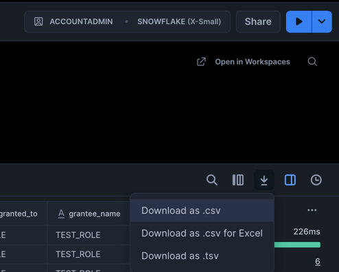

# Migration script

<!-- TOC -->
* [Migration script](#migration-script)
    * [Compatibility with Provider Versions](#compatibility-with-provider-versions)
  * [Syntax](#syntax)
  * [Usage](#usage)
    * [Prerequisites](#prerequisites)
    * [Use case: Migrate deprecated grants to new ones](#use-case-migrate-deprecated-grants-to-new-ones)
    * [Use case: Migrate existing grants to Terraform](#use-case-migrate-existing-grants-to-terraform)
      * [1. Query Snowflake and save the output](#1-query-snowflake-and-save-the-output)
      * [2. Generate resources and import statements based on the Snowflake output](#2-generate-resources-and-import-statements-based-on-the-snowflake-output)
      * [3. Get the generated resources and import them to the state](#3-get-the-generated-resources-and-import-them-to-the-state)
<!-- TOC -->

This script is designed to assist in migrating existing Snowflake objects into Terraform management
by generating the necessary Terraform resources and import statements based on the Snowflake output.
It can be used for both one-time migrations from deprecated resources to the new ones,
as well as importing existing objects into Terraform state.

The script was provided to give an idea how the migration process can be automated.
It is not officially supported, and we do not prioritize fixes for it.
Feel free to use it as a starting point and modify it to fit your specific needs.
We are open to contributions to enhance its functionality.

### Compatibility with Provider Versions

The script is designed to work with the latest version of the provider.
However, if you're using an older version, you can still utilize the script as long as the object types you need are supported and haven't undergone major changes.
For instance, with grants, you can use the script to transition from [old to new grants](https://registry.terraform.io/providers/snowflakedb/snowflake/latest/docs/guides/grants_redesign_design_decisions#mapping-from-old-grant-resources-to-the-new-ones)
since they haven't significantly changed from the current provider version.

## Syntax

Use the following syntax to run the migration script from your terminal:

```shell
go run github.com/Snowflake-Labs/terraform-provider-snowflake/pkg/scripts/migration_script@main [flags] [OBJECT_TYPE] < [INPUT] > [OUTPUT]
```

> **Note**: It's recommended to use the latest version of the script by specifying `@main` at the end of the script path.

where script options are:
- **flags**:
  - `-h`: Displays help information about the script.
  - `-import`: Specifies the import format. Supported values are `statement` (default) and `block`. For example, to generate block imports, specify `-import=block`.
    - `block`: Generates [import blocks](https://developer.hashicorp.com/terraform/language/import) at the bottom of the generated Terraform configuration.
    - `statement`: Generates commented [import commands](https://developer.hashicorp.com/terraform/cli/commands/import) at the bottom of the generated Terraform configuration.
- **OBJECT_TYPES**:
  - `grants`: Generates resources and import statements for Snowflake grants. The expected input is in the form of [`SHOW GRANTS`](https://docs.snowflake.com/en/sql-reference/sql/show-grants) output (any filtering option).
- **INPUT**:
  - Migration script operates on STDIN input in CSV format. You can redirect the input from a file or pipe it from another command.
- **OUTPUT**:
  - Migration script writes the generated content to STDOUT. You can redirect the output wherever you need to, for example, to a file.
  - **It's user's responsibility to ensure that the output is written securely to a safe location and not to overwrite any important files.**

## Usage

The expected usage use cases for the scripts are either one-time migration from deprecated resources to the new ones,
or importing existing objects into Terraform state. They are both covered in the examples below (in the separate sections for each).
They focus on the grants object_type, but a similar approach could be used for other object types as well.

### Prerequisites

There are a few things needed before you can proceed further:
- To run the script in the recommended way, you will need:
  - Go installed, see https://go.dev/doc/install for more details.
- To test the Terraform configurations locally, you will need:
  - Terraform installed, see https://learn.hashicorp.com/tutorials/terraform/install-cli for more details.
  - Snowflake account with an ability to create sample roles and grant privileges (for simplicity, a user with ACCOUNTADMIN role would be the best choice).
  - Knowledge how to configure Snowflake connection using Terraform Provider, see [Terraforming Snowflake](https://quickstarts.snowflake.com/guide/terraforming_snowflake/index.html#0) guide for more details.

### Use case: Migrate deprecated grants to new ones

In this example, we will focus on migrating from the removed `snowflake_account_grant` resource to the new `snowflake_grant_privileges_to_account_role` resource.
Check [mapping old grant resources to the new ones](https://registry.terraform.io/providers/snowflakedb/snowflake/latest/docs/guides/grants_redesign_design_decisions#mapping-from-old-grant-resources-to-the-new-ones)
for more details on how to migrate other grant resources. Our starting configuration will look as follows:

> If you are not sure how to set it up, follow the [Terraforming Snowflake](http://quickstarts.snowflake.com/guide/terraforming_snowflake/index.html#0) guide.

```hcl
terraform {
  required_providers {
    snowflake = {
      source  = "snowflakedb/snowflake"
      version = "=0.92.0"
    }
  }
}

provider "snowflake" {
  # Your configuration options
}

resource "snowflake_role" "test_role" {
  name = "TEST_ROLE"
}

resource "snowflake_role" "other_test_role" {
  name = "OTEHR_TEST_ROLE"
}

resource "snowflake_account_grant" "grant" {
  roles             = [snowflake_role.test_role.name]
  privilege         = "CREATE ROLE"
  with_grant_option = false
}

resource "snowflake_account_grant" "other_grant" {
  roles             = [snowflake_role.other_test_role.name]
  privilege         = "CREATE DATABASE"
  with_grant_option = true
}
```

#### 1. Query Snowflake and save the output

Now, to get the list of grants we are interested in, we can either call

```sql
SHOW GRANTS TO ROLE TEST_ROLE;
SHOW GRANTS TO ROLE TEST_OTHER_ROLE;
```

and combine the outputs, or we can call

```sql
SHOW GRANTS ON ACCOUNT;
```

and filter the output to only include the grants to the roles we are interested in.

> If you use SnowSight, you can click on the "Download" button and select "CSV" format.
>
> 

Whatever way you choose, save the output to a CSV file as `example.csv`.
The file contents should look similar to this:

```csv
"created_on","privilege","granted_on","name","granted_to","grantee_name","grant_option","granted_by"
"2025-09-02 05:42:30.602 -0700","CREATE ROLE","ACCOUNT","VG98132","ROLE","TEST_ROLE","false","USERADMIN"
"2025-09-02 05:41:59.399 -0700","CREATE DATABASE","ACCOUNT","VG98132","ROLE","OTHER_TEST_ROLE","true","SYSADMIN"
```

#### 2. Generate resources and import statements based on the Snowflake output

To use the script with the saved output, run the following command in the terminal:

```shell
go run github.com/Snowflake-Labs/terraform-provider-snowflake/pkg/scripts/migration_script@main -import=block grants < ./example.csv
```

> For more details on the command-line options, run:
> ```shell
> go run github.com/Snowflake-Labs/terraform-provider-snowflake/pkg/scripts/migration_script@main -h
> ```

The script will read the input from the standard input (stdin) and generate the corresponding Terraform resources and import statements as import blocks.
The output is directed to the standard output (stdout), which can be redirected to a file if needed, by running:

```shell
go run github.com/Snowflake-Labs/terraform-provider-snowflake/pkg/scripts/migration_script@main -import=block grants < ./example.csv > ./output.tf
```

> **It's user's responsibility to ensure that the output is written securely to a safe location and not to overwrite any important files.**

Whichever way you choose, the final configuration should look similar to this:

```hcl
terraform {
  required_providers {
    snowflake = {
      source  = "snowflakedb/snowflake"
      version = "=0.92.0"
    }
  }
}

provider "snowflake" {
  # Your configuration options
}

resource "snowflake_role" "test_role" {
  name = "TEST_ROLE"
}

resource "snowflake_role" "other_test_role" {
  name = "OTEHR_TEST_ROLE"
}

resource "snowflake_account_grant" "grant" {
  roles             = [snowflake_role.test_role.name]
  privilege         = "CREATE ROLE"
  with_grant_option = false
}

resource "snowflake_account_grant" "other_grant" {
  roles             = [snowflake_role.other_test_role.name]
  privilege         = "CREATE DATABASE"
  with_grant_option = true
}

resource "snowflake_grant_privileges_to_account_role" "snowflake_generated_grant_on_account_to_TEST_ROLE_without_grant_option" {
  account_role_name = "\"TEST_ROLE\""
  on_account = true
  privileges = ["CREATE ROLE"]
  with_grant_option = false
}

resource "snowflake_grant_privileges_to_account_role" "snowflake_generated_grant_on_account_to_OTHER_TEST_ROLE_with_grant_option" {
  account_role_name = "\"OTHER_TEST_ROLE\""
  on_account = true
  privileges = ["CREATE DATABASE"]
  with_grant_option = true
}
import {
  to = snowflake_grant_privileges_to_account_role.snowflake_generated_grant_on_account_to_TEST_ROLE_without_grant_option
  id = "\"TEST_ROLE\"|false|false|CREATE ROLE|OnAccount"
}
import {
  to = snowflake_grant_privileges_to_account_role.snowflake_generated_grant_on_account_to_OTHER_TEST_ROLE_with_grant_option
  id = "\"OTHER_TEST_ROLE\"|true|false|CREATE DATABASE|OnAccount"
}
```

#### 4. Importing auto-generated resources to the state

Now that we have the generated resources and import blocks, we can proceed to replace the deprecated resources with the new ones.
First, we need to import the new resources into the state. Run `terraform plan`, to see if there are any issues with the configuration.
The plan should output:

```
Plan: 2 to import, 0 to add, 0 to change, 0 to destroy.
```

Now we are safe to apply the changes with `terraform apply`. You should see the output similar to:

```
Apply complete! Resources: 2 imported, 0 added, 0 changed, 0 destroyed.
```

which means that the resources have been successfully imported into the state.
Remember that, if you chose to use the import block approach, [after importing you can remove the import blocks from the configuration file](https://developer.hashicorp.com/terraform/language/import#plan-and-apply-an-impor).

#### 5. Removing old grant resources

Now that we have the new resources imported into the state, we can proceed to remove the old deprecated resources from the configuration.
To do that, you can either use the [removed blocks](https://support.hashicorp.com/hc/en-us/articles/33229234219411-Terraform-Enterprise-on-Replicated-March-2025-Final-Release) or [state commands](https://developer.hashicorp.com/terraform/cli/commands/state).
In this case, we will proceed with running the following state commands:

```shell
terraform state rm snowflake_account_grant.grant
terraform state rm snowflake_account_grant.other_grant
```

Now, you are safe to remove the old resources from the configuration file.
To confirm that everything is working as expected, run `terraform plan` again.
This time it should output:

```
No changes. Your infrastructure matches the configuration.
```

#### 6. Update generated resources

The last step is optional, but highly recommended. The generated resources have generic names, which are not very user-friendly,
and they do not depend on the existing role resources which they refer to in their configuration. 

To rename the resources, you can use the [terraform state mv](https://developer.hashicorp.com/terraform/cli/commands/state/mv) command or [moved block](https://developer.hashicorp.com/terraform/language/moved).

To properly link the resources, you either use the explicit dependency with `depends_on` argument,
or you can use implicit dependency by referring to the existing role resources in the `snowflake_grant_privileges_to_account_role`.
An example of the updated configuration is shown below:

```hcl
terraform {
  required_providers {
    snowflake = {
      source  = "snowflakedb/snowflake"
      version = "=0.92.0"
    }
  }
}

provider "snowflake" {
  # Your configuration options
}

resource "snowflake_role" "test_role" {
  name = "TEST_ROLE"
}

resource "snowflake_role" "other_test_role" {
  name = "OTEHR_TEST_ROLE"
}

resource "snowflake_grant_privileges_to_account_role" "snowflake_generated_grant_on_account_to_TEST_ROLE_without_grant_option" {
  account_role_name = "\"${snowflake_role.test_role.name}\""
  on_account = true
  privileges = ["CREATE ROLE"]
  with_grant_option = false
}

resource "snowflake_grant_privileges_to_account_role" "snowflake_generated_grant_on_account_to_OTHER_TEST_ROLE_with_grant_option" {
  account_role_name = "\"${snowflake_role.other_test_role.name}\""
  on_account = true
  privileges = ["CREATE DATABASE"]
  with_grant_option = true
}
```

By following the above steps, you can migrate other deprecated Snowflake resources and start managing the new ones!

### Use case: Migrate existing grants to Terraform

In this case, we will focus on importing existing grants into Terraform state to start managing them.

#### 1. Query Snowflake and save the output

To have some data to work with, we will create two sample roles and grant them some privileges on the account.
To set up the necessary objects, run the following commands in Snowflake (e.g., using SnowSight):

```sql
CREATE ROLE TEST_ROLE;
GRANT CREATE DATABASE ON ACCOUNT TO ROLE TEST_ROLE;
GRANT CREATE ROLE ON ACCOUNT TO ROLE TEST_ROLE;

CREATE ROLE TEST_OTHER_ROLE;
GRANT CREATE DATABASE ON ACCOUNT TO ROLE TEST_OTHER_ROLE;
GRANT CREATE ROLE ON ACCOUNT TO ROLE TEST_OTHER_ROLE;
GRANT CREATE USER ON ACCOUNT TO ROLE TEST_OTHER_ROLE;
```

Now, to get the list of grants we are interested in, we can either call

```sql
SHOW GRANTS TO ROLE TEST_ROLE;
SHOW GRANTS TO ROLE TEST_OTHER_ROLE;
```

and combine the outputs, or we can call

```sql
SHOW GRANTS ON ACCOUNT;
```

and filter the output to only include the grants to the roles we are interested in.

> If you use SnowSight, you can click on the "Download" button and select "CSV" format.
> 
> 

Whatever way you choose, save the output to a CSV file as `example.csv`.
The file contents should look similar to this:

```csv
"created_on","privilege","granted_on","name","granted_to","grantee_name","grant_option","granted_by"
"2025-08-29 06:23:25.920 -0700","CREATE DATABASE","ACCOUNT","IYA62698","ROLE","TEST_ROLE","false","SYSADMIN"
"2025-08-29 06:23:27.253 -0700","CREATE ROLE","ACCOUNT","IYA62698","ROLE","TEST_ROLE","false","USERADMIN"
"2025-08-29 06:23:29.902 -0700","CREATE DATABASE","ACCOUNT","IYA62698","ROLE","TEST_OTHER_ROLE","false","SYSADMIN"
"2025-08-29 06:23:31.390 -0700","CREATE ROLE","ACCOUNT","IYA62698","ROLE","TEST_OTHER_ROLE","false","USERADMIN"
"2025-08-29 06:23:32.747 -0700","CREATE USER","ACCOUNT","IYA62698","ROLE","TEST_OTHER_ROLE","false","USERADMIN"
```

#### 2. Generate resources and import statements based on the Snowflake output

To use the script with the saved output, run the following command in the terminal:

```shell
go run github.com/Snowflake-Labs/terraform-provider-snowflake/pkg/scripts/migration_script@main -import=block grants < ./example.csv
```

> For more details on the command-line options, run:
> ```shell
> go run github.com/Snowflake-Labs/terraform-provider-snowflake/pkg/scripts/migration_script@main -h
> ```

The script will read the input from the standard input (stdin) and generate the corresponding Terraform resources and import statements as import blocks.
The output is directed to the standard output (stdout), which can be redirected to a file if needed, by running:

```shell
go run github.com/Snowflake-Labs/terraform-provider-snowflake/pkg/scripts/migration_script@main -import=block grants < ./example.csv > ./output.tf
```

> **It's user's responsibility to ensure that the output is written securely to a safe location and not to overwrite any important files.**

#### 3. Get the generated resources and import them to the state

In this example, we will create a new Terraform project, but you can also use an existing one.
If you are not sure how to do it, follow the [Terraforming Snowflake](http://quickstarts.snowflake.com/guide/terraforming_snowflake/index.html#0) guide.
Create a new directory and navigate to it, create a new file named `main.tf` with the following content:

```hcl
terraform {
  required_providers {
    snowflake = {
      source  = "snowflakedb/snowflake"
      version = "=2.6.0"
    }
  }
}

provider "snowflake" {
  # Your configuration options (remember to connect to the same account where you created the roles)
}
```

and run the `terraform init` command.

After project initialization, copy the generated resources and import blocks from the previous step into the main file.
The file should look similar to this:

```hcl
terraform {
  required_providers {
    snowflake = {
      source  = "snowflakedb/snowflake"
      version = "=2.6.0"
    }
  }
}

provider "snowflake" {
  # Your configuration options (remember to connect to the same account where you created the roles)
}

resource "snowflake_grant_privileges_to_account_role" "snowflake_generated_grant_on_account_to_TEST_OTHER_ROLE_without_grant_option" {
  account_role_name = "TEST_OTHER_ROLE"
  on_account = true
  privileges = ["CREATE DATABASE", "CREATE ROLE", "CREATE USER"]
  with_grant_option = false
}

resource "snowflake_grant_privileges_to_account_role" "snowflake_generated_grant_on_account_to_TEST_ROLE_without_grant_option" {
  account_role_name = "TEST_ROLE"
  on_account = true
  privileges = ["CREATE DATABASE", "CREATE ROLE"]
  with_grant_option = false
}
import {
  to = snowflake_grant_privileges_to_account_role.snowflake_generated_grant_on_account_to_TEST_OTHER_ROLE_without_grant_option
  id = "\"TEST_OTHER_ROLE\"|false|false|CREATE DATABASE,CREATE ROLE,CREATE USER|OnAccount"
}
import {
  to = snowflake_grant_privileges_to_account_role.snowflake_generated_grant_on_account_to_TEST_ROLE_without_grant_option
  id = "\"TEST_ROLE\"|false|false|CREATE DATABASE,CREATE ROLE|OnAccount"
}
```

Then run `terraform plan`. You should see the following output:

```
  # snowflake_grant_privileges_to_account_role.snowflake_generated_grant_on_account_to_TEST_OTHER_ROLE_without_grant_option will be imported
    resource "snowflake_grant_privileges_to_account_role" "snowflake_generated_grant_on_account_to_TEST_OTHER_ROLE_without_grant_option" {
        account_role_name = "\"TEST_OTHER_ROLE\""
        all_privileges    = false
        always_apply      = false
        id                = "\"TEST_OTHER_ROLE\"|false|false|CREATE DATABASE,CREATE ROLE,CREATE USER|OnAccount"
        on_account        = true
        privileges        = [
            "CREATE DATABASE",
            "CREATE ROLE",
            "CREATE USER",
        ]
        with_grant_option = false
    }

  # snowflake_grant_privileges_to_account_role.snowflake_generated_grant_on_account_to_TEST_ROLE_without_grant_option will be imported
    resource "snowflake_grant_privileges_to_account_role" "snowflake_generated_grant_on_account_to_TEST_ROLE_without_grant_option" {
        account_role_name = "\"TEST_ROLE\""
        all_privileges    = false
        always_apply      = false
        id                = "\"TEST_ROLE\"|false|false|CREATE DATABASE,CREATE ROLE|OnAccount"
        on_account        = true
        privileges        = [
            "CREATE DATABASE",
            "CREATE ROLE",
        ]
        with_grant_option = false
    }

Plan: 2 to import, 0 to add, 0 to change, 0 to destroy.
```

which indicates that the resources are ready to be imported.

Finally, run the following command to import the resources into the state, by running `terraform apply`.
At the end of the command, you should see an output similar to this:

```
Apply complete! Resources: 2 imported, 0 added, 0 changed, 0 destroyed.
```

which means that the resources have been successfully imported into the state.
Remember that, if you chose to use the import block approach, [after importing you can remove the import blocks from the configuration file](https://developer.hashicorp.com/terraform/language/import#plan-and-apply-an-impor).

By following the above steps, you can migrate other existing Snowflake objects into Terraform and start managing them!